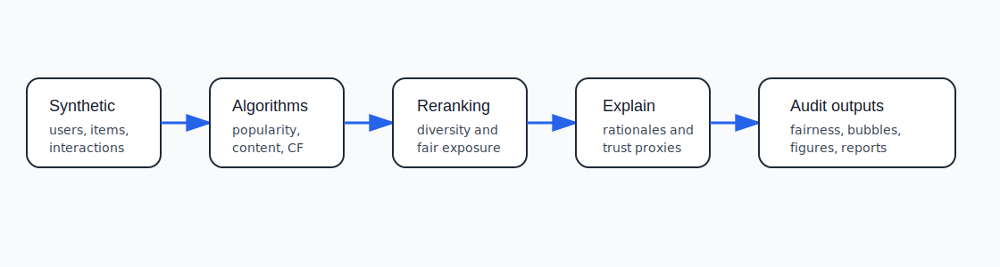
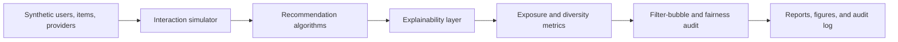

# Explainable Recommender Systems Fairness Lab

<p align="center"><strong>Research-grade recommender systems lab for studying recommendation bias, filter bubbles, exposure fairness, item diversity, explainability, user trust proxies, and auditability.</strong></p>

<p align="center">
  <a href="../../actions/workflows/python-checks.yml"></a>
  <a href="LICENSE"></a>
  
  
</p>

> **Recommendation-support boundary:** this repository uses fictional synthetic users, items, providers, creators, and interactions by default. It is research and audit infrastructure only. It must not be used to automatically rank real people, suppress real creators, make platform policy decisions, or infer sensitive user traits without governance, privacy review, and human oversight.

---

## Research objective

Can explainable and fairness-aware recommender systems reduce popularity bias, filter bubbles, and exposure inequality while preserving relevance and improving user trust?

| Research question | Evidence generated locally |
| --- | --- |
| Which algorithms concentrate exposure on popular items? | Popularity-bias and exposure-concentration metrics |
| Which users receive narrow recommendations? | Filter-bubble and diversity reports |
| Are provider groups exposed fairly? | Provider exposure fairness audit |
| Do explanations improve reviewability? | Explanation coverage and explanation-quality proxy scores |
| Does reranking preserve relevance? | Algorithm comparison table |
| Can recommendation audits be reproduced? | Hash-chained audit ledger |

---

## Architecture

<p align="center"></p>



---

## Run today — no private platform data needed

```bash
python scripts/run_synthetic_recommender_lab.py
```

Windows quick start:

```bat
cd %USERPROFILE%\explainable-recommender-fairness-lab
git pull

py -m venv .venv
.venv\Scripts\activate

python -m pip install --upgrade pip
python -m pip install -r requirements.txt
python scripts/run_synthetic_recommender_lab.py
```

Optional controls:

```bash
python scripts/run_synthetic_recommender_lab.py --users 120 --items 180 --top-k 10 --seed 42
```

---

## Generated local outputs

```text
outputs/results/synthetic_users.csv
outputs/results/synthetic_items.csv
outputs/results/synthetic_interactions.csv
outputs/results/synthetic_recommendations.csv
outputs/results/synthetic_algorithm_comparison.csv
outputs/results/synthetic_exposure_fairness_audit.csv
outputs/results/synthetic_filter_bubble_report.csv
outputs/results/synthetic_explanation_audit.csv
outputs/results/synthetic_user_trust_audit.csv
outputs/results/synthetic_recommender_summary.json
outputs/reports/synthetic_recommender_fairness_report.md
outputs/audit/recommender_fairness_audit_log.jsonl

outputs/figures/synthetic_algorithm_relevance.png
outputs/figures/synthetic_exposure_fairness.png
outputs/figures/synthetic_filter_bubble_risk.png
outputs/figures/synthetic_provider_exposure.png
outputs/figures/synthetic_trust_proxy.png
```

---

## Algorithms included

| Method | Purpose |
| --- | --- |
| `popularity` | Baseline showing popularity and exposure concentration risk |
| `content_based` | Matches item categories/tags to user interaction history |
| `collaborative_similarity` | Uses similar-user interaction overlap as a lightweight collaborative baseline |
| `diversity_rerank` | Reorders recommendations to increase category and provider diversity |
| `fairness_rerank` | Reorders recommendations to improve exposure for under-exposed provider groups |

---

## What the system audits

| Audit area | Metrics/examples |
| --- | --- |
| Popularity bias | Mean item popularity percentile and top-decile exposure share |
| Exposure fairness | Provider-group exposure share, exposure gap, under-exposure flag |
| Filter bubbles | Category entropy, provider entropy, dominant-category share |
| Diversity | Intra-list diversity and catalog coverage proxy |
| Explainability | Explanation coverage, reason count, explanation-quality proxy |
| Trust | Balanced trust proxy from relevance, diversity, explanation quality, and risk |
| Transparency | Recommendation rationale and hash-chained audit records |

---

## Human governance boundary

This lab supports research and model review. Real deployments require privacy review, platform-policy validation, appeal mechanisms for providers, abuse monitoring, user controls, accessibility review, and careful evaluation with real-world stakeholders.

The system should never be used as the sole basis for creator visibility decisions, user profiling, content moderation, financial ranking, political exposure decisions, or high-stakes personalization.

---

## Repository map

```text
src/recfair/
  synthetic.py        # fictional users, items, providers, interactions
  recommenders.py    # popularity/content/collaborative/reranking algorithms
  explanations.py    # explanation generation and explanation audit
  metrics.py         # relevance, diversity, exposure, filter-bubble metrics
  fairness.py        # provider and subgroup fairness audit
  audit.py           # hash-chained audit ledger
  visualization.py   # local figures
  reporting.py       # Markdown report
scripts/
  run_synthetic_recommender_lab.py
docs/
  methodology.md
  responsible_recommender_policy.md
  synthetic_lab.md
  report_template.md
tests/
  test_synthetic.py
  test_recommenders.py
  test_metrics.py
  test_pipeline.py
  test_audit.py
```

---

## Limitations

- Synthetic data validates the pipeline but does not prove real-world platform impact.
- Trust scores are proxy indicators, not measured user psychology.
- Fairness metrics are descriptive and must be interpreted with domain context.
- Real deployments need stronger causal evaluation, privacy controls, and human governance.
