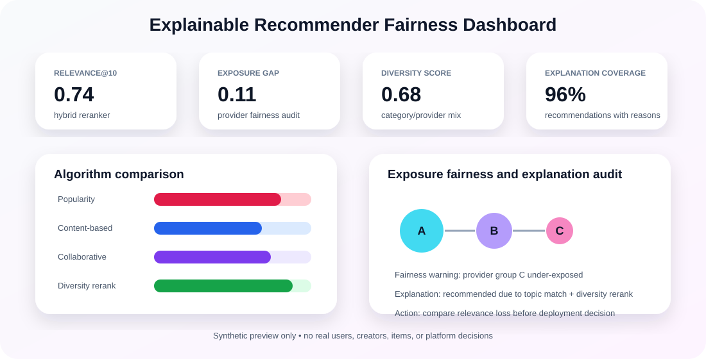
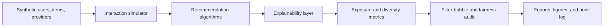
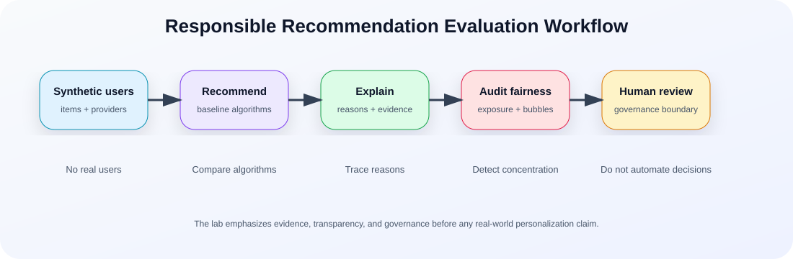

<p align="center">
  
</p>

<h1 align="center">Explainable Recommender Systems Fairness Lab</h1>

<p align="center">
  <b>A research-grade recommender-systems laboratory for studying exposure fairness, popularity bias, filter bubbles, diversity, explanations, trust proxies, and auditable recommendation behavior.</b>
</p>

<p align="center">
  <a href="../../actions/workflows/python-checks.yml"></a>
  
  
  
  
  
</p>

---

## Overview

**Explainable Recommender Systems Fairness Lab** is an independent academic research prototype for studying how recommendation algorithms shape visibility, opportunity, diversity, and user experience. It uses fictional synthetic users, items, providers, creators, and interactions to compare different recommendation strategies without relying on private platform data.

The lab is designed around a responsible-research question: **can recommendation systems improve relevance while reducing popularity bias, filter bubbles, and unfair exposure concentration?**

It focuses on:

- Transparent recommendation baselines.
- Exposure fairness across provider or creator groups.
- Filter-bubble and narrowness detection.
- Diversity-aware and fairness-aware reranking.
- Explanation generation and explanation coverage.
- Trust and reviewability proxy metrics.
- Reproducible evidence bundles and hash-chained audit logs.

> **Recommendation-support boundary:** This repository uses fictional synthetic users, items, providers, creators, and interactions by default. It is research and audit infrastructure only. It must not be used to automatically rank real people, suppress real creators, make platform policy decisions, or infer sensitive user traits without governance, privacy review, and human oversight.

<p align="center">
  
</p>

---

## Research objective

Can explainable and fairness-aware recommender systems reduce popularity bias, filter bubbles, and exposure inequality while preserving relevance and improving human reviewability?

| Research question | Evidence generated locally |
|---|---|
| Which algorithms concentrate exposure on popular items? | Popularity-bias and exposure-concentration metrics |
| Which users receive narrow recommendations? | Filter-bubble and diversity reports |
| Are provider groups exposed fairly? | Provider exposure fairness audit |
| Do explanations improve reviewability? | Explanation coverage and explanation-quality proxy scores |
| Does reranking preserve relevance? | Algorithm comparison table |
| Can recommendation audits be reproduced? | CSV results, Markdown report, figures, and hash-chained audit ledger |

---

## Architecture


```mermaid
flowchart LR
  A[Synthetic users, items, providers] --> B[Interaction simulator]
  B --> C[Recommendation algorithms]
  C --> D[Explainability layer]
  D --> E[Exposure and diversity metrics]
  E --> F[Filter-bubble and fairness audit]
  F --> G[Reports, figures, and audit log]
```

<p align="center">
  
</p>

The workflow intentionally starts with transparent baselines before making any stronger personalization claim. Every output should be interpreted as a research signal, not a deployment decision.

---

## Core capabilities

| Capability | What it does | Why it matters |
|---|---|---|
| Synthetic recommender data | Generates fictional users, items, providers, creators, and interactions | Enables safe experimentation without private platform data |
| Baseline algorithms | Compares popularity, content-based, collaborative, diversity reranking, and fairness reranking | Shows how recommendation behavior changes across approaches |
| Exposure fairness audit | Measures provider-group exposure shares and gaps | Helps identify whether visibility is concentrated or uneven |
| Filter-bubble report | Audits category entropy, provider entropy, and dominant-category share | Highlights narrow or repetitive recommendations |
| Diversity metrics | Measures intra-list diversity and catalog coverage proxies | Studies the relevance-diversity trade-off |
| Explanation layer | Generates transparent reasons for recommendations | Improves reviewability and debugging |
| Trust proxy audit | Combines relevance, diversity, explanation quality, and risk signals | Provides a synthetic indicator for comparison only |
| Audit ledger | Records reproducible run metadata in a hash-chained log | Supports traceability and research accountability |

---

## Run today — no private platform data needed

```bash
python scripts/run_synthetic_recommender_lab.py
```

Windows quick start:

```bat
cd %USERPROFILE%\explainable-recommender-fairness-lab
git pull

py -m venv .venv
.venv\Scripts\activate

python -m pip install --upgrade pip
python -m pip install -r requirements.txt
python scripts/run_synthetic_recommender_lab.py
```

Optional controls:

```bash
python scripts/run_synthetic_recommender_lab.py --users 120 --items 180 --top-k 10 --seed 42
```

Run tests:

```bash
python -m pytest
```

---

## Generated local outputs

```text
outputs/results/synthetic_users.csv
outputs/results/synthetic_items.csv
outputs/results/synthetic_interactions.csv
outputs/results/synthetic_recommendations.csv
outputs/results/synthetic_algorithm_comparison.csv
outputs/results/synthetic_exposure_fairness_audit.csv
outputs/results/synthetic_filter_bubble_report.csv
outputs/results/synthetic_explanation_audit.csv
outputs/results/synthetic_user_trust_audit.csv
outputs/results/synthetic_recommender_summary.json
outputs/reports/synthetic_recommender_fairness_report.md
outputs/audit/recommender_fairness_audit_log.jsonl

outputs/figures/synthetic_algorithm_relevance.png
outputs/figures/synthetic_exposure_fairness.png
outputs/figures/synthetic_filter_bubble_risk.png
outputs/figures/synthetic_provider_exposure.png
outputs/figures/synthetic_trust_proxy.png
```

---

## Algorithms included

| Method | Purpose | Main risk to inspect |
|---|---|---|
| `popularity` | Recommends globally popular items | Can over-concentrate exposure on already popular items |
| `content_based` | Matches item categories/tags to user history | Can narrow recommendations around past behavior |
| `collaborative_similarity` | Uses similar-user interaction overlap | Can inherit majority-preference and sparse-data bias |
| `diversity_rerank` | Reorders recommendations to increase category and provider diversity | May reduce relevance if over-weighted |
| `fairness_rerank` | Reorders recommendations to improve exposure for under-exposed provider groups | Requires careful trade-off reporting |

---

## Evaluation metrics

| Audit area | Metrics/examples |
|---|---|
| Relevance | Hit-rate proxy, ranking quality, algorithm comparison |
| Popularity bias | Mean item popularity percentile, top-decile exposure share |
| Exposure fairness | Provider-group exposure share, exposure gap, under-exposure flag |
| Filter bubbles | Category entropy, provider entropy, dominant-category share |
| Diversity | Intra-list diversity and catalog coverage proxy |
| Explainability | Explanation coverage, reason count, explanation-quality proxy |
| Trust proxy | Balanced score from relevance, diversity, explanation quality, and risk |
| Transparency | Recommendation rationale and hash-chained audit records |

---

## Explainability design

The explanation layer is transparent and audit-oriented. It should describe why an item appeared without pretending to know a user’s private intent.

Example explanation types:

- Recommended because the item matches topics in the user’s previous interactions.
- Recommended because similar synthetic users interacted with related items.
- Included to improve category diversity.
- Included to reduce provider exposure imbalance.
- Flagged for review because it may intensify a dominant-category pattern.

This design supports human inspection, debugging, and responsible reporting.

---

## Human governance boundary

This lab supports research and model review. Real deployments require privacy review, platform-policy validation, appeal mechanisms for providers, abuse monitoring, user controls, accessibility review, and careful evaluation with real-world stakeholders.

The system should never be used as the sole basis for creator visibility decisions, user profiling, content moderation, financial ranking, political exposure decisions, or high-stakes personalization.

---

## Repository map

```text
src/recfair/
  synthetic.py        fictional users, items, providers, creators, interactions
  recommenders.py    popularity, content, collaborative, diversity, fairness ranking
  explanations.py    explanation generation and explanation audit
  metrics.py         relevance, diversity, exposure, filter-bubble metrics
  fairness.py        provider and subgroup fairness audit
  audit.py           hash-chained audit ledger
  visualization.py   local figures
  reporting.py       Markdown recommender fairness report
scripts/
  run_synthetic_recommender_lab.py
docs/
  methodology.md
  responsible_recommender_policy.md
  synthetic_lab.md
  report_template.md
  governance-and-ethics.md
  reproducibility-playbook.md
  publication-readiness-plan.md
tests/
  test_synthetic.py
  test_recommenders.py
  test_metrics.py
  test_pipeline.py
  test_audit.py
```

---

## Documentation

- [`docs/governance-and-ethics.md`](docs/governance-and-ethics.md): responsible-use boundary, non-intended uses, fairness and explanation principles.
- [`docs/reproducibility-playbook.md`](docs/reproducibility-playbook.md): run records, evidence bundles, and reporting checklist.
- [`docs/publication-readiness-plan.md`](docs/publication-readiness-plan.md): research framing, candidate questions, and evidence needed for stronger claims.
- [`docs/methodology.md`](docs/methodology.md): synthetic methodology and evaluation approach.
- [`docs/report_template.md`](docs/report_template.md): structure for generated audit reports.

---

## Future extensions

| Extension | Requirement before claiming results |
|---|---|
| Neural recommenders | Model architecture, training logs, baseline comparison, privacy review |
| Real public dataset | License check, dataset statement, preprocessing documentation |
| User-study trust analysis | Human-subjects review and validated questionnaire design |
| Counterfactual explanations | Faithfulness tests and reviewer usability study |
| Fairness constraints | Sensitivity analysis for relevance/fairness trade-offs |
| Provider appeal simulation | Governance model and stakeholder feedback |

---

## Limitations

1. Synthetic data validates the pipeline but does not prove real-world platform impact.
2. Trust scores are proxy indicators, not measured user psychology.
3. Fairness metrics are descriptive and must be interpreted with domain context.
4. Exposure fairness can conflict with relevance, quality, safety, or policy goals.
5. Real deployments need stronger causal evaluation, privacy controls, stakeholder review, and ongoing monitoring.

## License

Released under the [MIT License](LICENSE). Real user, creator, provider, or platform datasets are not included.
